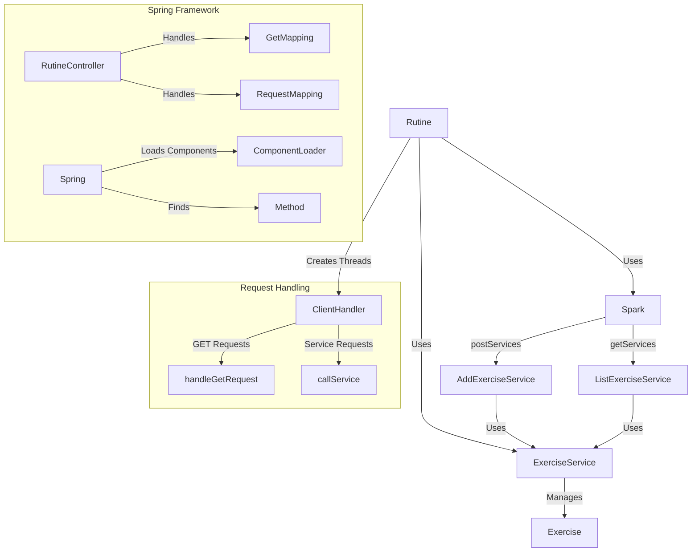
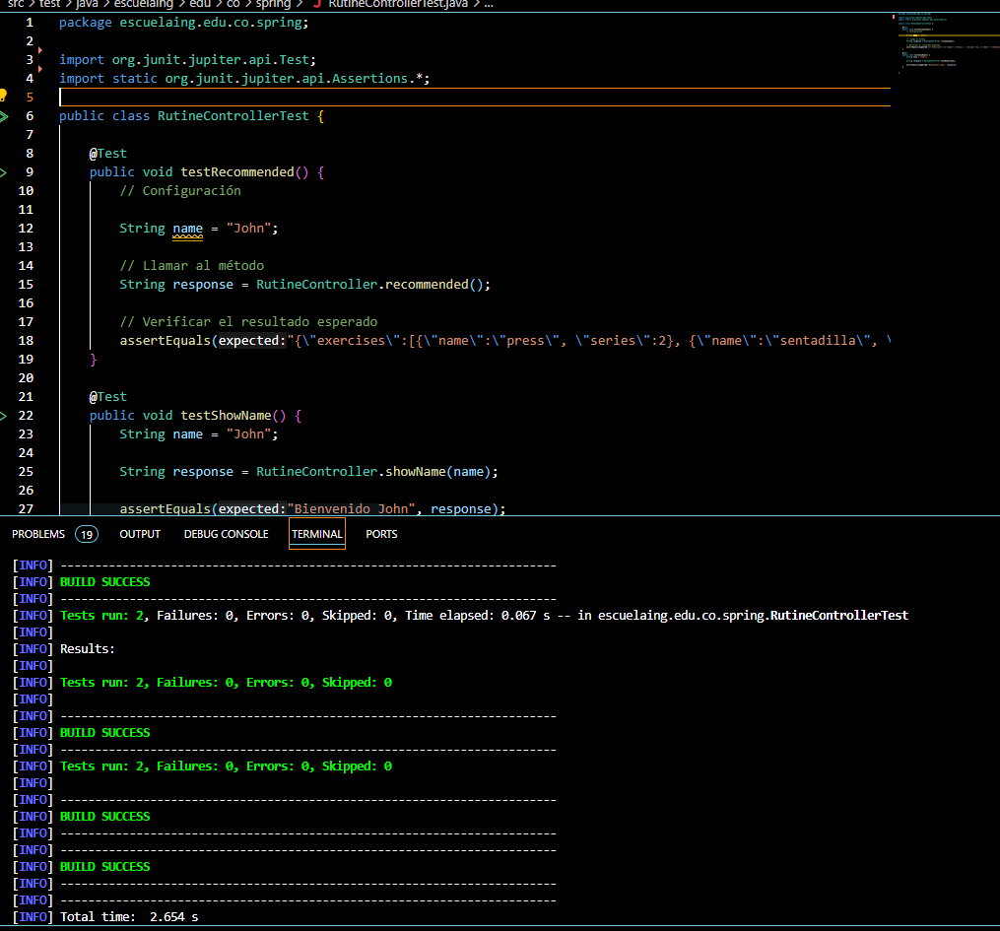

# AREP-LAB03
Autor: David Leonardo Piñeros Cortés

## Taller de Arquitecturas de Servidores de Aplicaciones, Meta protocolos de objetos, Patrón IoC, Reflexión
El objetivo de este taller es incluir nuevas funcionalidades a
nuestro servidor web construido durante el Taller 1 y 2, de forma
que se comporte como el framework Spring Boot pudiendo utilizar algunas anotaciones como @RestController, @GetMapping y @RequestParam.
## Instalación y Ejecución
El primer paso es instalar git, maven y java en su equipo con las siguientes versiones:

* Apache Maven 3.9.6

* Java 21

 y luego de esto clonar el repositorio desde la terminal de la siguiente manera:
```
git clone https://github.com/leoncico/AREP-LAB03.git
``` 
Seguido de esto, se ingresa a la carpeta resultante y se ejecutan los siguientes comandos de Maven:
```
mvn clean install
```
A continuación, ingresa el último comando para ejecutar el servidor:
```
java -cp target/classes escuelaing.edu.co.spring.Rutine
```
Ya debería estar en ejecución el servidor así que ingresa desde un Browser a la dirección [localhost:8080/greeting.html]() para interactuar con la aplicación web.

Para probar las nuevas funcionalidades implementadas para este Taller podrás ingresar tu nombre en el campo indicado, el cuál será enviado como parametro de tipo RequestParam en el método showName el cuál tiene la etiqueda GetMapping. En caso de que
no se ingrese un valor, se establecerá un nombre por defecto.


Para la siguiente funcionalidad presiona Siguiente y se mostrará el apartado para agregar un ejercicio a la rutino, adicionalmente se muestra un Botón en la parte superior que si se presiona mostrará una lista de ejercicios quemados en el código, esta lista se obtiene con un método de la clase RutineController con la anotación RequestMapping.


## Arquitectura
La arquitectura utilizada se alinea con el patrón de Cliente - Servidor, en el cual existe un servidor que aloja todos los recursos (en un
directorio seleccionado por el desarrollador) y uno o más clientes pueden acceder y usar estos recursos por medio de solicitudes que son respondidas con ayuda de los servicios REST del Backend. En este taller se utilizan conceptos avanzados de programación orientada a objetos y reflección en Java para hacer que la arquitectura sea más flexible y extensible.

Algunos de sus componentes principales son:
* Rutine Controller: Maneja las solicitudes entrantes a través de métodos anotados con @RequestMapping y @GetMapping. Estos métodos responden a solicitudes específicas y pueden usar parámetros de consulta.
* RESTService: Es una interfaz que define el método response, que será implementado por los servicios que definen las reglas de negocio.
* AddExerciseService y ListExerciseService: Implementaciones de RESTService que manejan la lógica para agregar ejercicios y listar ejercicios (mas especificamente se agregó un nuevo método en este servicio que retorna un Json con los ejercicios sugeridos).
* ClientHandler: Este componente maneja las conexiones de los clientes. Escucha las solicitudes HTTP, las procesa y devuelve respuestas. También se encarga de la gestión de archivos estáticos cuando se recibe una solicitud GET.
* ComponentLoader: Este componente busca y carga las clases anotadas con @RestController en el paquete especificado, lo que permite la detección automática de controladores.



## Evaluación

Se prueban los metodos implementados